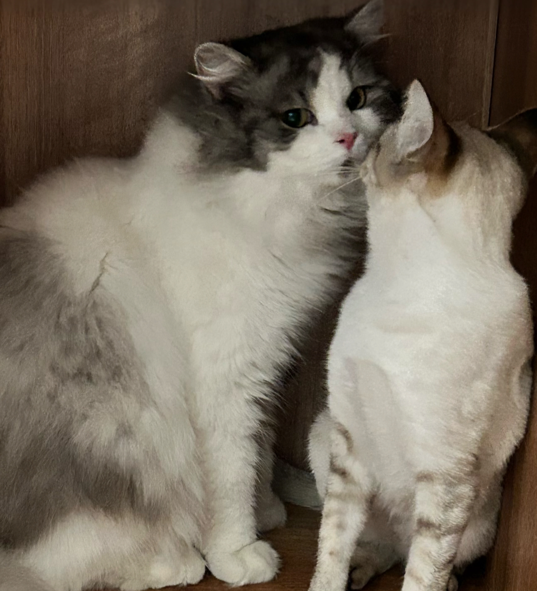

\
\

# Welcome
\
\

\ Welcome to my website, I'm Cheng Rao, or you can call me Flex, 

\ I'm from China, a very beautiful country far away from the United States.

\ I like music and games, I used to be a drummer in a student band, and I often play some moba games. 

\ I also do some sports but not too much, just basic badminton level.

\
\
\
\

  
  

  

<b> it's me, loving sunglasses </b>

\
\

# Abilities and Interests
\
\

\ I am interested in Health Science and Statistics.

\ Majored in biology in my undergraduate school, and now in the Mailman School of Public Health, PS track.

\ Have some work experience with analyzing real life medical care data, using Python, still a freshman to R.

_Here is my github page _
_[repo](https://github.com/Cheng-cr3442)_

\
\
\
\
\

# something interesting about my life

\
\

  
  

  

<b> my graduate pictures with girlfriend </b>

\
\
\
\

  
  

  

<b> my cute cats </b>

\
\
\
\

  
  

  

<b> my handsome dog </b>

\
\
\
